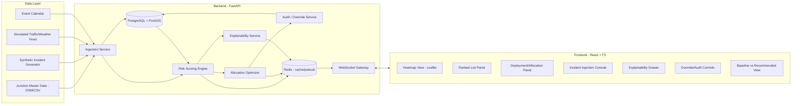

# Technical Requirements Document (TRD)
## RakshaGrid — AI Traffic Risk Heatmap & Police Deployment Decision Support

---

## 1. System Architecture Overview



## 2. Recommended Tech Stack

| Layer | Choice | Why |
|---|---|---|
| Frontend | **React 18 + TypeScript + Vite** | Fast dev loop, strong typing under time pressure |
| UI Kit | **Tailwind CSS + shadcn/ui** | Rapid, professional dark-mode ops-center UI |
| Map | **Leaflet + react-leaflet** (+ `leaflet.heat`) | Free, no API key friction, good heatmap plugin |
| Charts | **Recharts** | Fast to wire, clean for score breakdowns/trends |
| Real-time | **WebSockets (native via FastAPI)** | Simple, no extra broker needed for hackathon scale |
| Backend | **Python 3.11 + FastAPI** | Async, fast to build, same language as ML |
| ML/Scoring | **scikit-learn / XGBoost (optional) + rule-based weighted model** | Transparent, explainable, quick to train on synthetic data |
| Optimization | **SciPy `linear_sum_assignment` (Hungarian algorithm)** or greedy heuristic | Proven, fast, easy to explain to judges |
| Explainability | **Template-based NL generation**, optionally polished via **Anthropic Claude API** | Human-readable reasoning without a fragile black box |
| Database | **PostgreSQL + PostGIS** | Geospatial queries (distance, zone, nearest officer) |
| Cache/PubSub | **Redis** | Fast recompute broadcast to WebSocket clients |
| Auth (demo) | **Simple JWT (FastAPI-Users or custom)** | Enough for "operator login" demo, not a focus area |
| Containerization | **Docker + docker-compose** | One-command spin-up for judges |
| Deployment | **Frontend: Vercel/Netlify · Backend: Render/Railway/Fly.io** | Free-tier friendly, fast to deploy in hours not days |
| CI | **GitHub Actions** (lint + basic test on push) | Signals engineering maturity to judges |
| Version control | **GitHub monorepo** | Single source of truth for 5-person team |

> Fallback if backend team is Python-light: swap FastAPI → Node.js/Express + TypeScript, and optimizer → `munkres`/custom greedy JS. Keep this only as a documented fallback, not the plan.

## 3. Core Algorithms

### 3.1 Risk Scoring Model
Composite score `R(j)` for junction `j`, range 0–100:

```
R(j) = w1*AccidentDensity(j) + w2*CongestionLevel(j) + w3*ViolationRate(j)
     + w4*WeatherSeverity(j) + w5*EventProximity(j) + w6*ObstructionFlag(j)
     + w7*TimeOfDayPattern(j)
```

- Each sub-feature normalized 0–1 against zone/historical baseline.
- Default weights hand-tuned + justified in write-up; optional logistic/XGBoost regression trained on synthetic "labeled" incident outcomes to auto-derive weights if time allows.
- Every score carries a **feature-contribution vector** (`w_i * feature_i`) for the explainability layer — this is what makes it interpretable, not a black box.

### 3.2 Personnel Allocation Optimizer
- Formulate as a weighted bipartite assignment: officers (supply) → junctions (demand), cost = `-(risk_score) + travel_time_penalty`.
- Solve via `scipy.optimize.linear_sum_assignment` for ≤ officers/junctions counts feasible in demo (e.g., 15 officers × 30 junctions); fall back to a greedy "assign highest-risk-uncovered-first, nearest officer" heuristic if a clean bipartite formulation runs short on time.
- Re-solve on: (a) fixed interval (e.g., every 2 min simulated), (b) new incident injected, (c) manual override.

### 3.3 Unmanned High-Risk Detection
Simple threshold rule: `if R(j) >= RISK_THRESHOLD and coverage(j) == None: flag(j)`. Threshold configurable per zone.

### 3.4 Explainability Generation
Template fills top 2–3 contributing features by weight into a natural-language sentence; optional single Claude API call to smooth phrasing for the top-N junctions only (keeps latency/cost low — not called per-request for all junctions).

## 4. Data Requirements

| Dataset | Source for Hackathon | Fields |
|---|---|---|
| Junction master list | OpenStreetMap (Nagpur extract) or manually curated ~30–50 major junctions | id, name, lat, lng, zone, road_class |
| Historical incidents | Synthetic generator seeded with realistic patterns (peak hours, rain days) | junction_id, timestamp, type, severity |
| Live traffic/congestion | Simulated (randomized/patterned by time-of-day) | junction_id, timestamp, congestion_index |
| Weather | Static/simulated (or OpenWeatherMap free tier if internet allowed) | date, condition, severity |
| Events | Manually seeded calendar (festival, VIP visit, match day) | date, location, impact_radius |
| Officer roster | Synthetic (15–25 officers) | officer_id, current_location, shift, zone |

## 5. API Surface (see Backend Schema doc for full detail)
- `GET /api/junctions` — list + current risk scores
- `GET /api/junctions/{id}/explain` — feature contribution + NL reason
- `GET /api/deployment/current` — current officer assignment
- `GET /api/deployment/recommended` — optimizer output
- `POST /api/deployment/{id}/override` — accept/modify/reject
- `POST /api/incidents` — inject simulated incident
- `GET /api/deployment/comparison` — baseline vs recommended
- `WS /ws/live` — push risk/deployment updates

## 6. Non-Functional Requirements
- Recommendation recompute: **<3s** after incident injection (target for demo dataset size).
- Frontend map render: **<1.5s** initial load for ~50 junctions.
- All state reproducible from a **seed file** for reliable live demo.
- Dockerized for **one-command local run** (`docker-compose up`).
- No PII beyond synthetic officer IDs; no facial/vehicle-identity data used.

## 7. Scalability & Retrofit Note (for submission)
- Junction ingestion is source-agnostic (CSV/OSM now → live ICCC/ANPR/RLVD feed adapters later via the same `Ingestion Service` interface).
- PostGIS scales geospatial queries to thousands of junctions; Redis pub/sub decouples scoring throughput from WebSocket fan-out.
- Optimizer swaps to a scalable solver (e.g., OR-Tools CP-SAT) beyond ~500 officers/junctions without changing the API contract.
- Deployable on existing ICCC infrastructure as a **read-only decision-support layer** — no changes required to existing ATCS/RLVD/ANPR systems, minimizing retrofit cost and risk.

## 8. Privacy & Ethics Note (for submission)
- No facial recognition or individual vehicle re-identification.
- Aggregated/anonymized violation counts only.
- All demo data synthetic or public/open; no confidential departmental systems accessed (per problem statement's explicit allowance).
- Human-in-the-loop by design: AI recommends, human commander decides — every override logged for accountability.