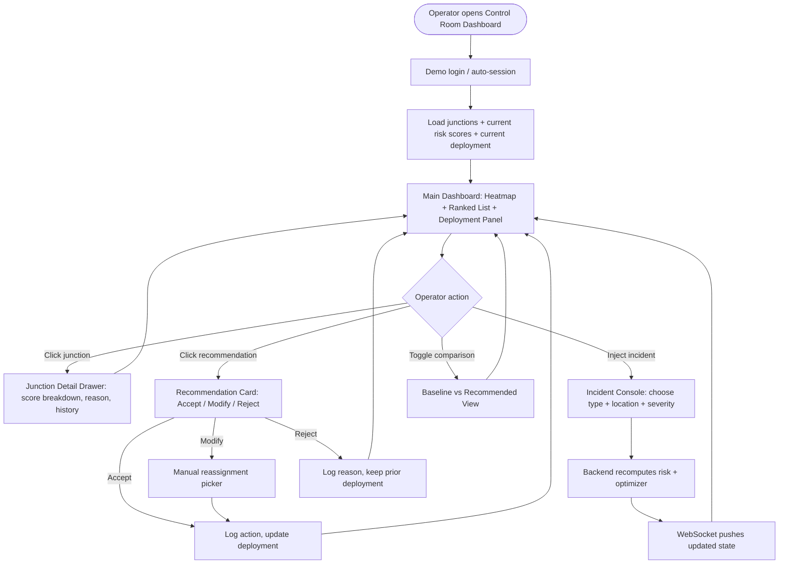

# Application Flow Document
## RakshaGrid — AI Traffic Risk Heatmap & Police Deployment Decision Support

---

## 1. High-Level User Flow



## 2. Screen-by-Screen Flow

### 2.1 Login / Session Start
- Minimal — pre-filled demo credentials ("Control Room Operator — Nagpur Central").
- On success → straight to Main Dashboard (no onboarding needed for a control-room tool).

### 2.2 Main Dashboard (single screen, ops-center layout)
- **Left:** Full-width heatmap of Nagpur with color-coded junction markers (green/amber/red), zone clustering, filter chips (time window, risk category, manned/unmanned).
- **Right:** Tabbed panel — (a) Ranked Attention List, (b) Deployment Plan, (c) Incident Console.
- **Top bar:** live clock, active-incident ticker, officer count (deployed/available), overall city risk index.
- **Bottom drawer (collapsible):** Explainability / audit log feed.

### 2.3 Junction Detail Drawer
Opens on marker/list-item click:
- Score gauge (0–100) + trend sparkline.
- Feature contribution bar chart (accident density, congestion, violations, weather, event, obstruction).
- Plain-language reason sentence.
- Coverage status (manned/unmanned, officer ID if manned).
- Mini incident history for that junction.

### 2.4 Deployment / Recommendation Panel
- Ranked cards: junction, risk score, recommended officer (from where), ETA.
- Per-card actions: **Accept** (one click) / **Modify** (reassign picker) / **Reject** (reason dropdown + free text).
- Every action instantly reflected on the heatmap (marker gets a badge: covered ✅).

### 2.5 Incident Injection Console (the "wow" demo moment)
- Operator (or scripted demo) picks: incident type (accident / waterlogging / VIP movement / festival crowd / road obstruction), location (map click or dropdown), severity slider.
- Submit → loading state (<3s) → live re-ranking animation on heatmap + updated recommendation cards + toast notification: *"New high-risk zone detected near [X] — 2 junctions now unmanned above threshold."*

### 2.6 Baseline vs. Recommended Comparison View
- Split map or toggle switch: "Current/Manual Roster" vs. "RakshaGrid Recommended."
- Summary stat bar: uncovered high-risk junctions (baseline: N) → (recommended: M), % improvement highlighted.

### 2.7 Audit Log / Explainability Feed
- Chronological feed: every score change, incident, and operator decision, each with timestamp + reason — the accountability trail for government trust.

## 3. System-Level Data Flow

```mermaid
sequenceDiagram
    participant Sim as Data Simulator
    participant Ing as Ingestion Service
    participant DB as PostgreSQL/PostGIS
    participant Score as Risk Scoring Engine
    participant Opt as Allocation Optimizer
    participant WS as WebSocket Gateway
    participant UI as Frontend Dashboard

    Sim->>Ing: periodic traffic/weather/incident ticks
    Ing->>DB: persist raw signals
    DB->>Score: fetch latest features per junction
    Score->>DB: write risk scores + contributions
    Score->>Opt: pass ranked risk list
    Opt->>DB: write recommended deployment
    DB->>WS: publish updated state (via Redis)
    WS->>UI: push live update
    UI->>Opt: operator override (accept/modify/reject)
    Opt->>DB: persist override + audit entry
```

## 4. Incident Simulation Flow (Demo Script Detail)
1. Operator opens Incident Console.
2. Selects "Accident — Severe" at a currently green/amber junction.
3. Submits.
4. Backend: injects incident row → triggers immediate rescore of affected junction + neighbors within radius → reruns optimizer.
5. Frontend: WebSocket push animates marker color transition, ranked list reorders, new recommendation card appears highlighted, toast notification fires.
6. Operator clicks recommendation → Accept → marker gets "covered" badge, audit log entry appended.

## 5. Error / Edge-Case Flows
- **No officers available for a high-risk junction:** UI shows a red "unmanned — no capacity" flag with an "escalate" action (log only, no real escalation in demo).
- **WebSocket disconnect:** frontend falls back to polling `GET` endpoints every 5s, banner shows "reconnecting…".
- **Conflicting manual override during recompute:** last-write-wins with an audit note "overridden after automatic recompute."