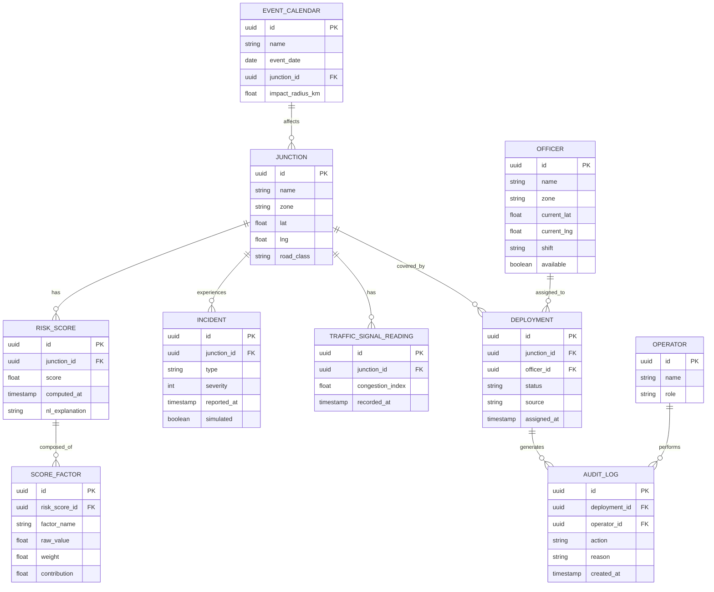

# Backend Schema Document
## RakshaGrid — AI Traffic Risk Heatmap & Police Deployment Decision Support

---

## 1. Entity Relationship Diagram



## 2. Table Definitions (PostgreSQL + PostGIS)

### `junctions`
| Column | Type | Notes |
|---|---|---|
| id | UUID PK | |
| name | TEXT | |
| zone | TEXT | e.g. "Sitabuldi", "Sadar" |
| location | GEOGRAPHY(Point, 4326) | PostGIS point for lat/lng |
| road_class | TEXT | arterial / collector / local |
| created_at | TIMESTAMPTZ | |

### `risk_scores`
| Column | Type | Notes |
|---|---|---|
| id | UUID PK | |
| junction_id | UUID FK → junctions | |
| score | NUMERIC(5,2) | 0–100 |
| nl_explanation | TEXT | generated reason |
| computed_at | TIMESTAMPTZ | indexed, latest-per-junction query pattern |

### `score_factors`
| Column | Type | Notes |
|---|---|---|
| id | UUID PK | |
| risk_score_id | UUID FK → risk_scores | |
| factor_name | TEXT | accident_density / congestion / violations / weather / event / obstruction / time_pattern |
| raw_value | NUMERIC | normalized 0–1 |
| weight | NUMERIC | model weight |
| contribution | NUMERIC | raw_value * weight |

### `incidents`
| Column | Type | Notes |
|---|---|---|
| id | UUID PK | |
| junction_id | UUID FK | |
| type | TEXT | accident / waterlogging / vip_movement / festival / obstruction |
| severity | SMALLINT | 1–5 |
| reported_at | TIMESTAMPTZ | |
| simulated | BOOLEAN | true for hackathon demo data |

### `traffic_signal_readings`
| Column | Type | Notes |
|---|---|---|
| id | UUID PK | |
| junction_id | UUID FK | |
| congestion_index | NUMERIC | 0–1 |
| recorded_at | TIMESTAMPTZ | |

### `officers`
| Column | Type | Notes |
|---|---|---|
| id | UUID PK | |
| name | TEXT | synthetic |
| zone | TEXT | |
| location | GEOGRAPHY(Point, 4326) | current position |
| shift | TEXT | |
| available | BOOLEAN | |

### `deployments`
| Column | Type | Notes |
|---|---|---|
| id | UUID PK | |
| junction_id | UUID FK | |
| officer_id | UUID FK (nullable) | null = unmanned |
| status | TEXT | recommended / accepted / modified / rejected |
| source | TEXT | optimizer / manual |
| assigned_at | TIMESTAMPTZ | |

### `operators`
| Column | Type | Notes |
|---|---|---|
| id | UUID PK | |
| name | TEXT | |
| role | TEXT | control_room_operator / commander |

### `audit_log`
| Column | Type | Notes |
|---|---|---|
| id | UUID PK | |
| deployment_id | UUID FK | |
| operator_id | UUID FK | |
| action | TEXT | accept / modify / reject |
| reason | TEXT | |
| created_at | TIMESTAMPTZ | |

### `event_calendar`
| Column | Type | Notes |
|---|---|---|
| id | UUID PK | |
| name | TEXT | e.g. "Ganesh Visarjan Procession" |
| event_date | DATE | |
| junction_id | UUID FK (nullable) | |
| impact_radius_km | NUMERIC | |

## 3. API Endpoints (REST + WebSocket)

| Method | Endpoint | Purpose | Response (key fields) |
|---|---|---|---|
| GET | `/api/junctions` | List junctions with latest risk score | `[{id, name, lat, lng, score, coverage_status}]` |
| GET | `/api/junctions/{id}/explain` | Score breakdown | `{score, factors:[{name, contribution}], nl_explanation}` |
| GET | `/api/deployment/current` | Current officer assignment | `[{junction_id, officer_id, status}]` |
| GET | `/api/deployment/recommended` | Optimizer output | `[{junction_id, officer_id, eta_min, reason}]` |
| POST | `/api/deployment/{id}/override` | Accept/modify/reject | body: `{action, officer_id?, reason}` |
| POST | `/api/incidents` | Inject simulated incident | body: `{junction_id, type, severity}` |
| GET | `/api/deployment/comparison` | Baseline vs recommended stats | `{baseline_uncovered, recommended_uncovered, pct_improvement}` |
| GET | `/api/officers` | Officer roster + status | `[{id, name, available, location}]` |
| GET | `/api/audit` | Audit trail feed | `[{action, reason, operator, timestamp}]` |
| WS | `/ws/live` | Push risk/deployment/incident updates | event-typed JSON messages |

### Sample WebSocket message
```json
{
  "event": "risk_update",
  "junction_id": "b3f1...",
  "score": 92.4,
  "nl_explanation": "Accident density 3x zone average with active waterlogging alert.",
  "coverage_status": "unmanned",
  "timestamp": "2026-08-13T14:32:10Z"
}
```

## 4. Indexing & Performance Notes
- `risk_scores(junction_id, computed_at DESC)` composite index for "latest score per junction" queries.
- PostGIS GIST index on `junctions.location` and `officers.location` for nearest-officer queries.
- Materialized view `latest_risk_scores` refreshed on each scoring cycle to keep `GET /api/junctions` O(1)-ish for dashboard load.